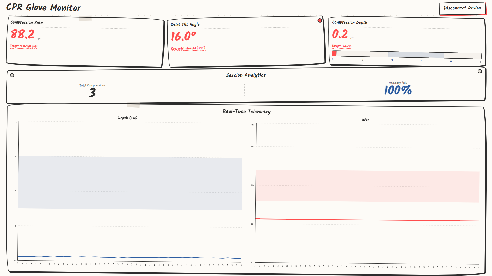

# 🩺 CPR Feedback Glove System

A real-time CPR training assistant built with an Arduino-based IoT glove and a Next.js web dashboard. The system monitors compression quality against AHA (American Heart Association) standards and gives instant visual feedback to help trainees improve technique.



---

## 🧠 How It Works

The glove uses two sensors wired to an Arduino:

| Sensor | Location | Purpose |
|--------|----------|---------|
| **FSR (Force Sensitive Resistor)** | Right glove palm | Detects compression force (raw analog) |
| **MPU6050 (6-axis IMU)** | Left glove wrist | Measures wrist tilt angle + estimates compression depth via double integration of accelerometer data |


The Next.js dashboard connects directly to the Arduino via the **Web Serial API** (no backend server needed) and renders all metrics in real time.

---

## 📊 AHA Standards Enforced

| Metric | Target | Description |
|--------|--------|-------------|
| **BPM** | 100 – 120 | Compression rate |
| **Wrist Tilt** | ≤ 15° | Wrist alignment during compressions |
| **Depth** | 3 – 6 cm | Compression depth (experimentally estimated) |

Cards turn **red** with a wavy underline warning when a metric falls outside the target range. The Arduino's onboard LEDs also mirror this — **green** for good technique, **red** for correction needed.

---

## 🖥️ Tech Stack

**Firmware**
- Arduino (C++) — `arduino_code.ino`
- Adafruit MPU6050 library
- Double-integration algorithm with drift compensation (leaky integrator, decay factor 0.92)

**Dashboard**
- [Next.js 15](https://nextjs.org/) (App Router)
- Web Serial API — direct browser ↔ Arduino communication
- [Recharts](https://recharts.org/) — real-time line graphs for Depth and BPM
- Custom hand-drawn sketch CSS aesthetic (Kalam + Patrick Hand fonts, wobbly borders, thumbtacks)

---

## 🚀 Running the Dashboard

### Prerequisites
- Google Chrome or Microsoft Edge (Web Serial API required)
- Node.js 18+
- Arduino flashed with `arduino_code.ino` and connected via USB

### Steps

```bash
# 1. Install dependencies
npm install

# 2. Start dev server
npm run dev

# 3. Open in Chrome
http://localhost:3000
```

Click **"Connect to COM7"**, select your Arduino's COM port from the browser prompt, and the dashboard will start streaming live data immediately.

---

## 📁 Project Structure

```
cpr2/
├── arduino_code.ino        # Arduino firmware (MPU6050 + FSR + LED feedback)
├── src/
│   └── app/
│       ├── page.tsx        # Main dashboard (Web Serial + Recharts)
│       ├── layout.tsx      # Font setup (Kalam, Patrick Hand)
│       └── globals.css     # Hand-drawn sketch theme
└── public/
    └── image.png           # Dashboard screenshot
```

---

## ⚙️ Arduino Wiring

| Component | Arduino Pin |
|-----------|-------------|
| FSR signal | `A0` |
| Green LED | `D2` |
| Red LED | `D3` |
| MPU6050 SDA | `A4` (I²C) |
| MPU6050 SCL | `A5` (I²C) |
| MPU6050 VCC | `3.3V` |
| MPU6050 GND | `GND` |

> **Calibration:** On power-up, hold the glove flat and still for ~2 seconds. The firmware samples 50 readings to establish baseline angle and gravity offset.

---

## 🔬 Depth Estimation (Experimental)

Compression depth is estimated via **double integration** of the MPU6050's vertical accelerometer axis:

1. Subtract the gravity baseline (`~9.8 m/s²`)
2. Integrate linear acceleration → velocity
3. Integrate velocity → position (depth)
4. Apply a leaky decay (`× 0.92`) each cycle to fight sensor drift


---

## 📄 License

MIT — free to use, modify, and build upon for educational and research purposes.
